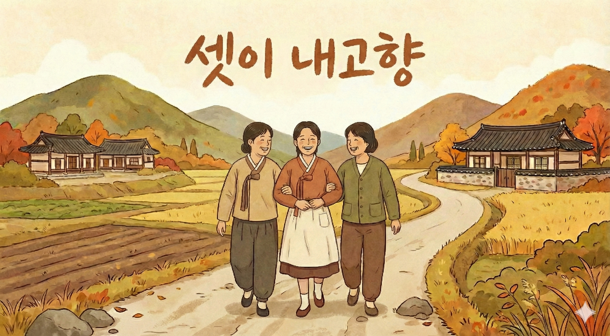
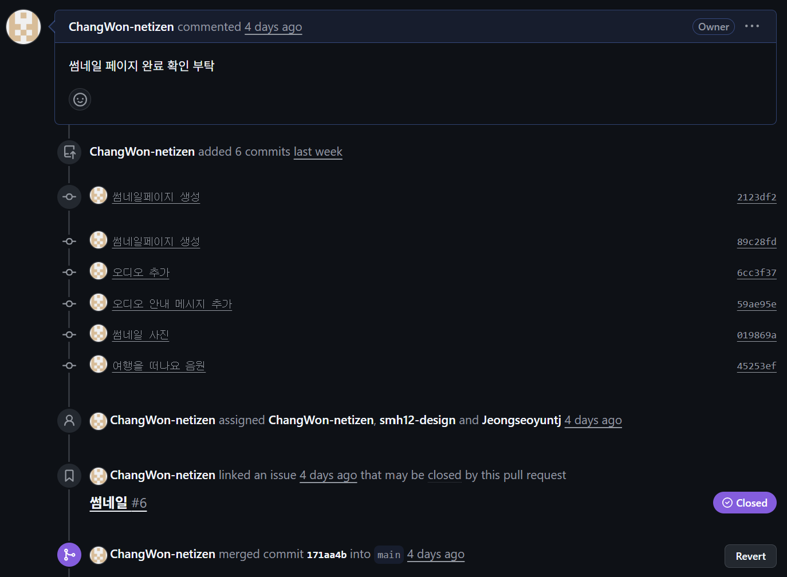
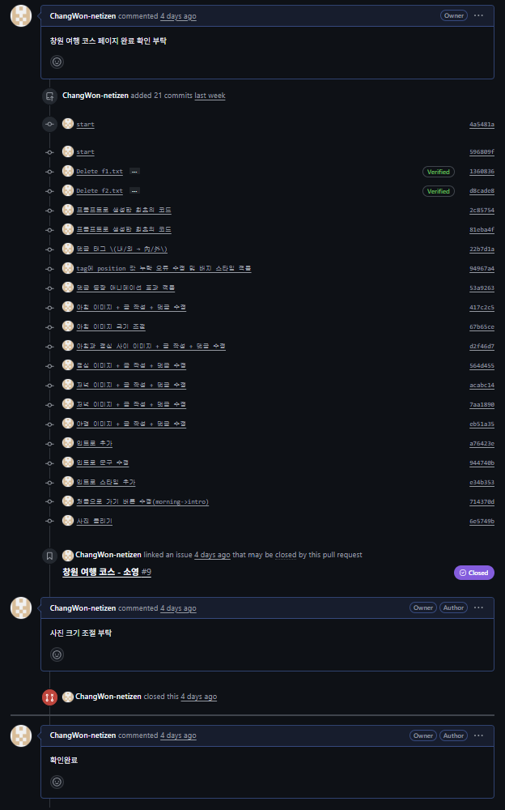
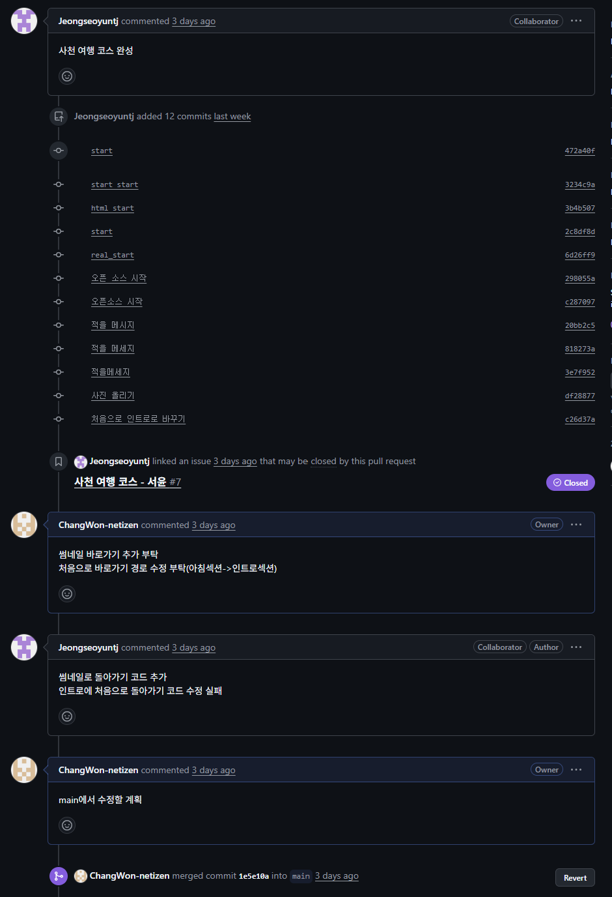
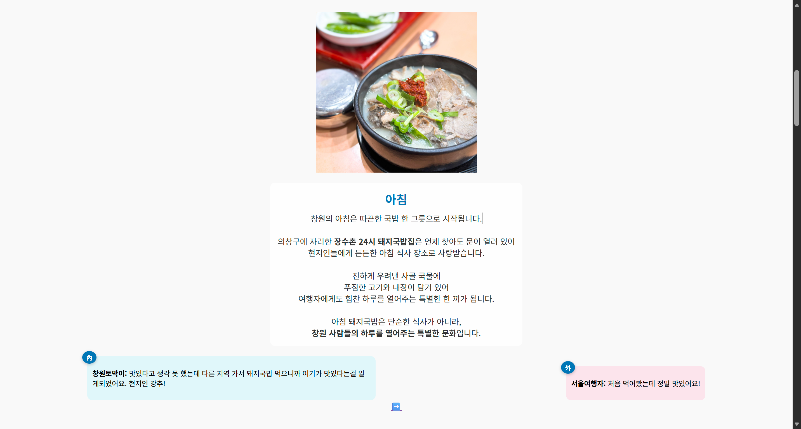
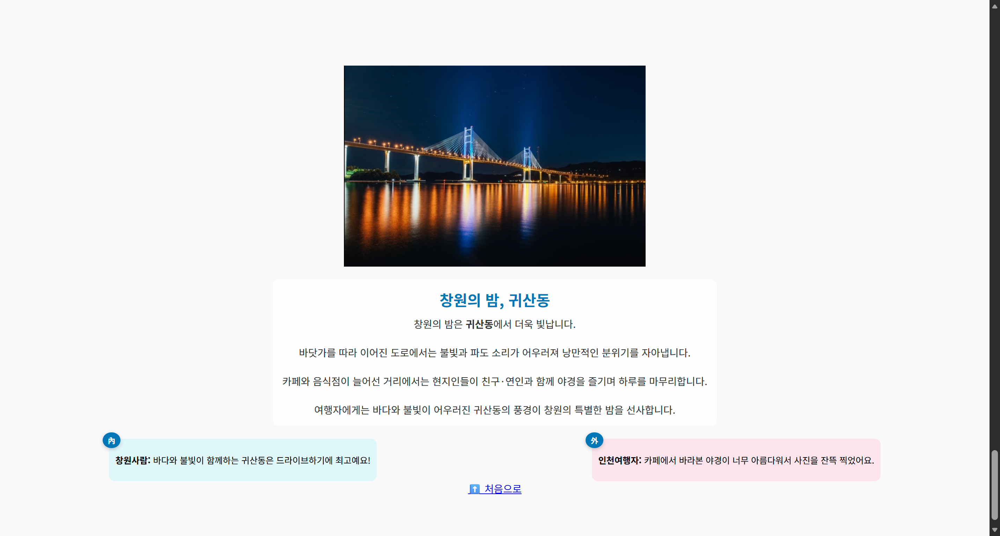

# 🏡 셋이 내고향 (Three's Hometown)

## 📖 프로젝트 소개
**셋이 내고향**은 창원, 사천, 군포 세 도시의 당일치기 여행 코스를 소개하는 웹페이지입니다.  
사진과 설명, 그리고 댓글을 통해 여행자들이 하루 여행을 쉽게 계획할 수 있도록 돕습니다.  
단순한 정보 나열이 아니라, 실제 여행 블로그처럼 즐길 수 있는 경험을 제공합니다 ✨  

---

## 🎬 프로젝트 배경
팀원들은 모두 대학교 친구로 서로 다른 고향에서 왔기에 늘 마음 한켠에는 **고향에 대한 그리움**이 있었습니다.  

이 프로젝트를 진행하면서 자연스럽게 고향 이야기를 나누게 되었고 그 과정에서 **고향을 다시 떠올리는 따뜻한 경험**을 할 수 있었습니다.  

특히 한국의 대표적인 지역 프로그램 <**6시 내고향**>을 오마주하여 현지인의 시선과 감성을 담아내고 싶었습니다.  
그래서 여행 코스를 짤 때도 일부러 **현지인들이 자주 가는 장소**를 중심으로 구성했습니다.  

---

## 링크
- [셋이 내고향 바로가기](https://changwon-netizen.github.io/sethi-naegohyang-threehour-culture-/)

---

## 팀원 소개
| 황소영(창원) | 정서윤(사천) | 홍민서(군포) |
|:---:|:---:|:---:|
| GitHub 관리  - 원격저장소 생성 및 관리 - 브랜치 전략 수립 - Pull Request 리뷰 및 Merge 관리  | 기획  - 웹페이지의 목적과 방향 설정 - 어떤 콘텐츠를 올릴지 기획 | 테스트  - 웹페이지 기능 테스트 - 오류 보고 및 개선 제안 - 사용자 피드백 수집 |
| 개발 - HTML, CSS, JavaScript 코드 작성 - 기능 구현 - 버그 수정 | 디자인 - 웹페이지 레이아웃 설계 - 색상, 폰트 스타일 결정 - 사용자 친화적인 UI/UX 개선 | 배포/운영 - GitHub Pages를 통한 배포 관리 - 활동 정리 및 README 문서 작성 |

---

## 🛠️ 사용 기술 (Tech Stack)
- **Frontend**: HTML, CSS, JavaScript  
- **Media**: JPEG/WEBP 이미지, MP3 배경 음악  
- **배포**: GitHub Pages
- **협업**: GitHub
- **문서**: Markdown (README 작성) 

---

## 📊 GitHub 활동 요약

### 1. Commit 기록
주요 변경 사항 기록
**커밋 메시지**: “Add Changwon itinerary”, “Fix image path”처럼 직관적으로 작성
- 썸네일 

- 창원 

- 사천 

- 군포 

### 2. Branch 전략
- 각자 페이지를 개별 브랜치에서 제작 → main 브랜치에 병합
- 프로젝트 보드(Project Board)에 작업 흐름 기록 

### 3. Issue && Pull Request & Merge
**Pull Request**: 기능별로 올려서 코드 리뷰 후 병합 

### 4. .gitignore
- 불필요한 파일 제외 설정

### 5. 상호 활동 
**협업 방식**: Issue로 할 일 관리, milestone으로 일정 체크 
- 팀원 간 협업 흔적

### 6. 원격 저장소 구조
- 디렉토리 및 파일 배치 
셋이 내고향/ 
├── .DS_Store 
├── .gitignore                # 필요없는 파일 
├── LICENSE                   # MIT 라이선스 
├── README.md                 # 프로젝트 설명 문서 
├── index.html                # 썸네일 페이지  
├── thumbnail.css             # 썸네일 스타일 
├── travel.mp3                # 여행 안내 음원 
├── Changwon.html             # 창원 페이지 
├── Changwon.css              # 창원 스타일 
├── Gunpo.html                # 군포 페이지 
├── Gunpo.css                 # 군포 스타일 
├── Sacheon.html              # 사천 페이지 
├── Sacheon_css.css           # 사천 스타일 
├── 감자옹심이.jpeg           # 창원 이미지 
├── 귀산동.jpeg               # 창원 이미지 
├── 달러미파크.jpeg           # 창원 이미지 
├── 둘레길.webp               # 창원 이미지 
├── 리버티테이블.jpeg         # 군포 이미지 
├── 반월옥.jpeg               # 군포 이미지 
├── 반월호수.jpeg             # 군포 이미지 
├── 오피스.jpeg               # 군포 이미지 
├── 웅궁.jpeg                 # 사천 이미지 
├── 웅지르수.jpeg             # 사천 이미지 
├── 유천리.jpeg               # 사천 이미지 
├── 유미정.jpeg               # 사천 이미지 
├── 장수촌.jpeg               # 사천 이미지 
├── 철쭉동산.jpeg             # 군포 이미지 
├── 초막골생태공원.jpeg       # 군포 이미지 
├── 케이블카.jpeg             # 사천 이미지 
├── 코끼리바위.jpeg           # 사천 이미지 
├── 할매칼국수.jpeg           # 사천 이미지 
└── 썸네일.png                # 썸네일 이미지 

---

## 🖼️ 페이지 구성 설명
- **index.html**: 썸네일 메인 페이지 (창원, 사천, 군포 선택)  
- **Changwon.html / Sacheon.html / Gunpo.html**: 도시별 일정 페이지  
  - 아침–점심–오후–저녁으로 나눈 추천 코스  
  - 명소와 음식점 사진 + 설명 + 댓글 섹션  
- **CSS 파일들**: 도시별 스타일과 썸네일 페이지 전용 스타일  

---

## 사용 방법
1. '**셋이 내고향**'에 접속합니다.

2. 셋이 내고향 문구를 클릭하여 음악을 들으며 흥을 끌어올립니다. 
3. 여행하고 싶은 지역을 선택합니다 
4. 시작 문구를 읽은 후 '여행 시작하기' 버튼을 클릭합니다. 

5. 여행 코스에 대한 정보와 댓글을 읽은 후 아래의 화살표를 클릭하여 다음 장소로 이동합니다.

6. 여행이 끝난 후 아래의 '처음으로 가기' 버튼을 클릭하여 '썸네일로 돌아가기' 버튼을 누르면 썸네일 페이지로 돌아갑니다.

---

## 🤝 기여 내역

### 📌 필요성
- 많은 사람들이 **짧은 일정으로 어디를 가야 할지** 고민합니다.  
- 특히 당일치기 여행은 정보가 흩어져 있어서 한눈에 보기 어렵습니다.  
- 이 프로젝트는 **도시별 하루 코스를 한 페이지에 정리**해, 여행 계획을 단순하고 직관적으로 만들고자 했습니다.  

### 🌟 주제의 의의
- 단순한 여행 안내가 아니라, **고향의 정서와 사람들의 이야기를 담은 웹페이지**입니다.
- “내고향”이라는 키워드를 통해, 사용자들이 **자신의 뿌리와 고향의 의미**를 다시 생각할 수 있도록 합니다.  
- 작은 프로젝트지만, **기획–구현–배포** 전 과정을 경험하며 협업과 문서화의 중요성을 체득했습니다.  

---

## ✨ 회고 (Retrospective)
- **배운 점**: 이미지 경로 관리의 중요성, 배포 환경에서 경로가 달라질 수 있다는 걸 체험.
- **아쉬운 점**: 파일명이 한글이라 환경에 따라 깨질 수 있었던 점.
- **개선점**: 폴더 구조를 더 체계적으로 관리.
- **느낀 점**: 단순한 웹페이지라도 기획–구현–배포 과정을 거치니 프로젝트 완성도가 크게 올라감.
예시 아직 완성 아님

## MIT License
Copyright (c) 2025 셋이 내고향
